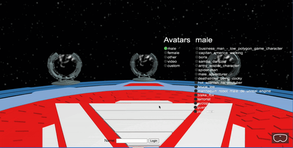

# VRspace

環境:kubernetes。


# 1. git clone

```
git clone https://github.com/kakeru-com/VRspace-on-kubernetes.git
```

# 2.change directory

```
cd $HOME/VRspace-on-kubernetes/VRspace
```

# 3. kubectl apply

```
kubectl apply -f VRspace-deployment.yaml
kubectl apply -f VRspace-service.yaml
 ```

# 2. endpoint確認

kubeコマンドでendpointを確認。

```
kubectl describe service vrspace-service
```

```nttcom@apn-test-aid:~$ kubectl describe service vrspace-service  
Name:                     vrspace-service
Namespace:                default
Labels:                   <none>
Annotations:              metallb.universe.tf/ip-allocated-from-pool: default
Selector:                 app=vrspace
Type:                     LoadBalancer
IP Family Policy:         SingleStack
IP Families:              IPv4
IP:                       10.97.247.55
IPs:                      10.97.247.55
LoadBalancer Ingress:     192.168.40.100
Port:                     <unset>  80/TCP
TargetPort:               8080/TCP
NodePort:                 <unset>  32702/TCP
Endpoints:                10.240.32.136:8080,10.240.32.138:8080
Session Affinity:         None
External Traffic Policy:  Cluster
Events:                   <none>
```

# 3. Endpointsのサービスにアクセス

```
curl http://10.240.32.136:8080/babylon/avatar-selection.html
```



